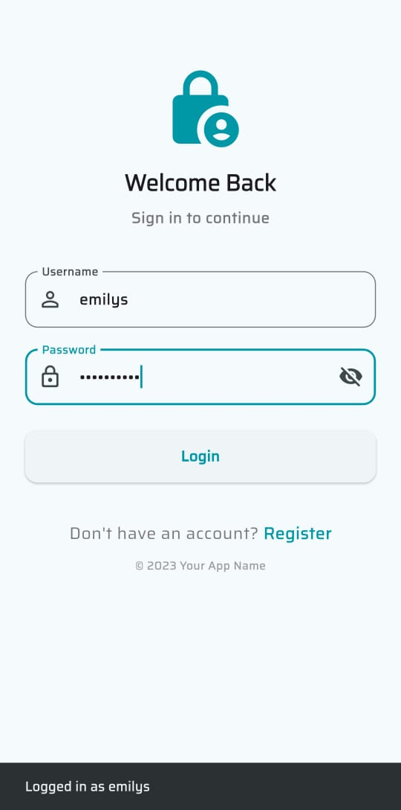
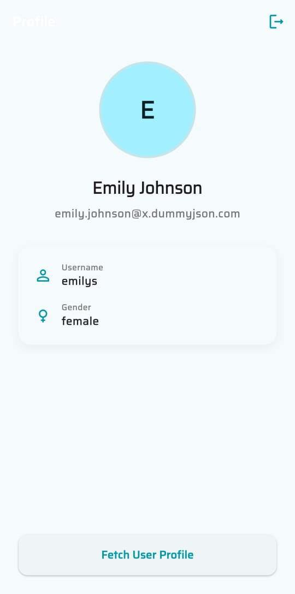
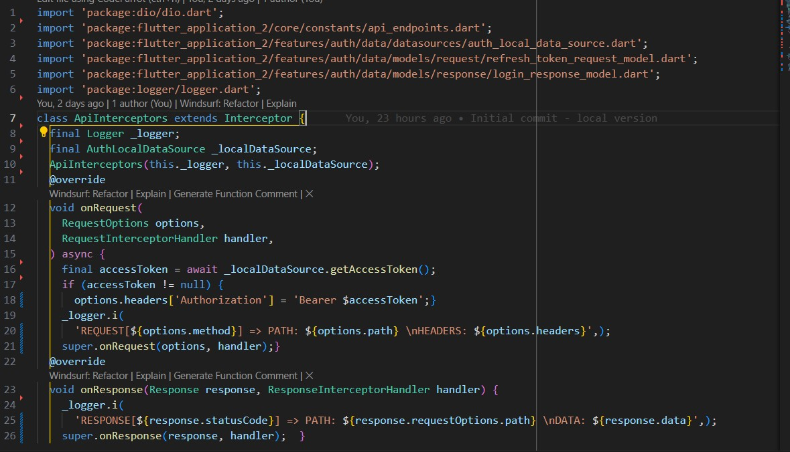
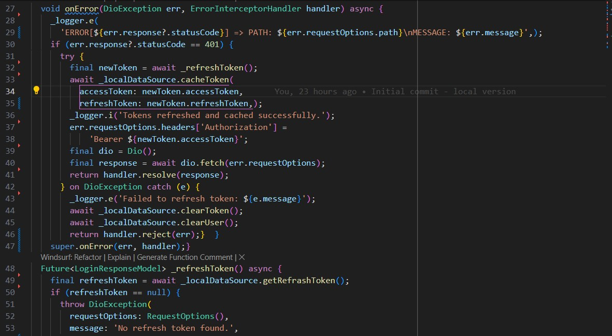
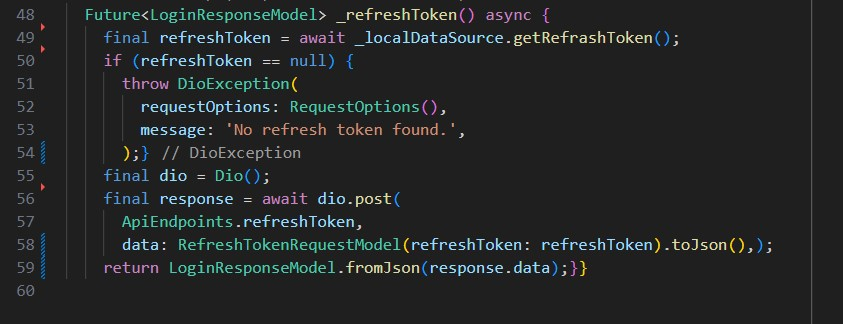

# Flutter Authentication App

A modern Flutter application demonstrating Clean Architecture principles with comprehensive authentication features, secure token management, and professional state management.

## 📸 Screenshots

| Login Screen | Home Screen | Profile Screen |
|--------------|-------------|----------------|
|  |  |  |

## 🎥 Demo Video


## Api Reference

This Flutter project demonstrates authentication using the [DummyJSON API](https://dummyjson.com/).

## Login Credentials
- Base URL: `https://dummyjson.com/`
- username: emilys
- password: emilyspass

## Test Login Credentials


## 🏗️ Architecture Overview

This project follows **Clean Architecture** principles, implementing a layered approach that separates concerns and promotes maintainability:

```
┌─────────────────────────────────────────────────────────────┐
│                    Presentation Layer                       │
│  ┌─────────────┐  ┌─────────────┐  ┌─────────────────────┐ │
│  │   Cubits    │  │   Screens   │  │      Widgets        │ │
│  └─────────────┘  └─────────────┘  └─────────────────────┘ │
└─────────────────────────────────────────────────────────────┘
┌─────────────────────────────────────────────────────────────┐
│                     Domain Layer                           │
│  ┌─────────────┐  ┌─────────────┐  ┌─────────────────────┐ │
│  │  Entities   │  │ Use Cases   │  │   Repositories      │ │
│  └─────────────┘  └─────────────┘  └─────────────────────┘ │
└─────────────────────────────────────────────────────────────┘
┌─────────────────────────────────────────────────────────────┐
│                      Data Layer                            │
│  ┌─────────────┐  ┌─────────────┐  ┌─────────────────────┐ │
│  │ DataSources │  │   Models    │  │   Repositories      │ │
│  └─────────────┘  └─────────────┘  └─────────────────────┘ │
└─────────────────────────────────────────────────────────────┘
┌─────────────────────────────────────────────────────────────┐
│                    Infrastructure Layer                     │
│  ┌─────────────┐  ┌─────────────┐  ┌─────────────────────┐ │
│  │   Network   │  │  Storage    │  │     Services        │ │
│  └─────────────┘  └─────────────┘  └─────────────────────┘ │
└─────────────────────────────────────────────────────────────┘
```

## 🚀 Key Features

### 🔐 Authentication System
- **User Registration & Login**: Secure user authentication with email/password
- **Token Management**: Automatic JWT token handling with refresh capability
- **Secure Storage**: Sensitive data stored using Flutter Secure Storage
- **Auto-logout**: Automatic logout on token expiration

### 🌐 Network Layer
- **HTTP Client**: Dio-based HTTP client with interceptors
- **Request/Response Logging**: Comprehensive logging for debugging
- **Token Interceptors**: Automatic token injection and refresh
- **Error Handling**: Graceful error handling with user feedback
### Network Layer ScreenShot
| InterCeptors1 | InterCeptors2  |InterCeptors3 |
|--------------|-------------|----------------|
|  |  |  |

### 💾 Data Management
- **Local Storage**: SharedPreferences for non-sensitive data
- **Secure Storage**: Encrypted storage for tokens and passwords
- **Repository Pattern**: Clean data access abstraction
- **Offline Support**: Local data caching for offline functionality

### 🎯 State Management
- **Cubit Pattern**: Lightweight state management using flutter_bloc
- **Reactive UI**: UI automatically updates based on state changes
- **Error States**: Proper error handling and user feedback

## 🛠️ Technology Stack

- **Framework**: Flutter 3.x
- **State Management**: flutter_bloc (Cubit)
- **Dependency Injection**: GetIt
- **HTTP Client**: Dio with interceptors
- **Storage**: SharedPreferences + Flutter Secure Storage
- **Routing**: GoRouter
- **Logging**: Logger package
- **Network Check**: Internet Connection Checker Plus

## 📁 Project Structure

```
lib/
├── core/                           # Core application functionality
│   ├── app_router.dart            # Application routing configuration
│   ├── constants/                 # App-wide constants
│   ├── errors/                    # Error handling and custom exceptions
│   ├── network/                   # Network layer implementation
│   │   ├── api_interceptors.dart  # HTTP request/response interceptors
│   │   ├── dio_client.dart        # HTTP client configuration
│   │   └── network_info.dart      # Network connectivity checker
│   └── storage/                   # Data storage implementations
│       ├── local_storage.dart     # Local data storage
│       └── secure_storage_manager.dart # Secure data storage
├── features/                      # Feature-based modules
│   └── auth/                      # Authentication feature
│       ├── data/                  # Data layer
│       │   ├── datasources/       # Data sources (local/remote)
│       │   ├── models/            # Data models
│       │   └── repositories/      # Repository implementations
│       ├── domain/                # Business logic layer
│       │   ├── entities/          # Business entities
│       │   ├── repositories/      # Repository interfaces
│       │   └── usecases/          # Business use cases
│       └── presentation/          # UI layer
│           ├── cubit/             # State management
│           ├── pages/             # Screen implementations
│           └── widgets/           # Reusable UI components
├── main.dart                      # Application entry point
└── service_locator.dart           # Dependency injection setup
```

## 🔧 Setup & Installation

### Prerequisites
- Flutter SDK 3.x or higher
- Dart SDK 3.x or higher
- Android Studio / VS Code
- Android SDK / Xcode (for mobile development)

### Installation Steps

1. **Clone the repository**
   ```bash
   git clone https://github.com/yourusername/flutter_application_2.git
   cd flutter_application_2
   ```

2. **Install dependencies**
   ```bash
   flutter pub get
   ```

3. **Run the application**
   ```bash
   flutter run
   ```

## 📱 Usage Examples

### Authentication Flow

```dart
// Login example
final authCubit = context.read<AuthCubit>();
await authCubit.login(email: 'user@example.com', password: 'password');

// Check authentication state
if (authCubit.state is AuthAuthenticated) {
  // User is logged in
  final user = (authCubit.state as AuthAuthenticated).user;
}
```

### Making Authenticated API Calls

```dart
// The interceptor automatically adds the token
final response = await dioClient.get('/api/profile');
// No need to manually add Authorization header
```

## 🔒 Security Features

- **Secure Token Storage**: JWT tokens stored in encrypted storage
- **Automatic Token Refresh**: Seamless token renewal without user intervention
- **Secure HTTP Headers**: Automatic Bearer token injection
- **Input Validation**: Comprehensive input sanitization and validation
- **Error Handling**: Secure error messages that don't leak sensitive information

## 🧪 Testing

The project includes comprehensive testing strategies:

- **Unit Tests**: Business logic and use cases
- **Widget Tests**: UI component testing
- **Integration Tests**: End-to-end user flows
- **Mock Testing**: Network and storage mocking

## 📊 Performance Optimizations

- **Lazy Loading**: Services loaded only when needed
- **Efficient State Management**: Minimal rebuilds with Cubit
- **Memory Management**: Proper disposal of resources
- **Network Optimization**: Request caching and deduplication
 
### Development Workflow

1. Fork the repository
2. Create a feature branch (`git checkout -b feature/amazing-feature`)
3. Commit your changes (`git commit -m 'Add amazing feature'`)
4. Push to the branch (`git push origin feature/amazing-feature`)
5. Open a Pull Request

## 📄 License

This project is licensed under the MIT License - see the [LICENSE](LICENSE) file for details.

## 🙏 Acknowledgments

- Flutter team for the amazing framework
- Clean Architecture community for architectural guidance
- Open source contributors for the packages used

## 📞 Support

If you have any questions or need support:

- 📧 Email: aimenelwhab@gmail.com

---

**Made with ❤️ using Flutter and Clean Architecture principles**
